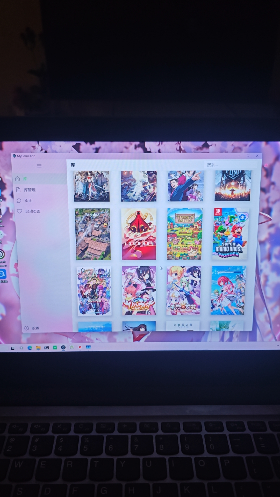

# 🎮 Game Library（Electron + Vue 3）

这是一个 **Electron 外壳 + Vue 3 前端** 的游戏库程序。  
后端非常轻量，仅包含一个数据库。

## ✨ 功能简介

- 📡 **从 IGDB 获取游戏数据**（需自行申请密钥）
- 🌐 **自动翻译游戏信息**（本地翻译模型）
- 🔍 **游戏搜索**
- ▶️ **直接启动游戏**
- 🧱 **主界面简洁**
- 🗂️ **游戏详情页……很拉**（H5 没有运动模糊效果，写得相当将就）

## ⚠️ 使用注意事项

- 🔑 **IGDB 数据获取**
  - 需要 **自行登录 IGDB 申请 API Key**
- 🤖 **翻译功能**
  - 使用的是 **本地翻译模型**
  - 效果有限，勉强能看
- 📂 **数据库**
  - ⚠️ **首次使用不要导入数据库文件**
  - 目前存在 **数据格式问题**
- ✍️ **代码说明**
  - 使用了 **AI 代笔**
  - 使用了 **部分开源代码**

一些截图：

